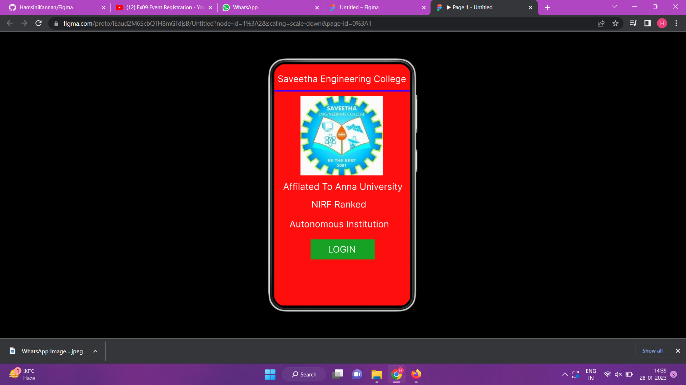
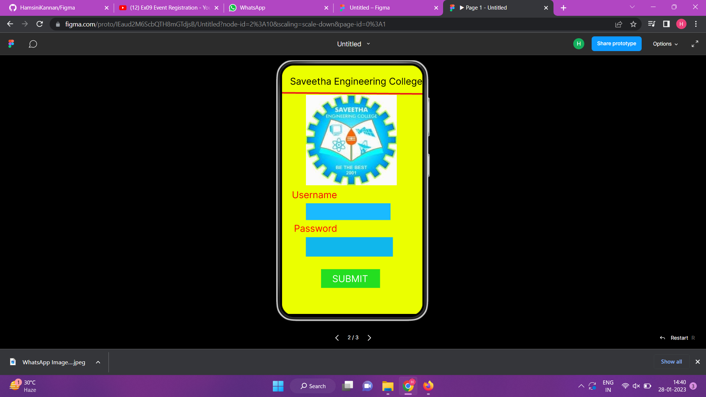
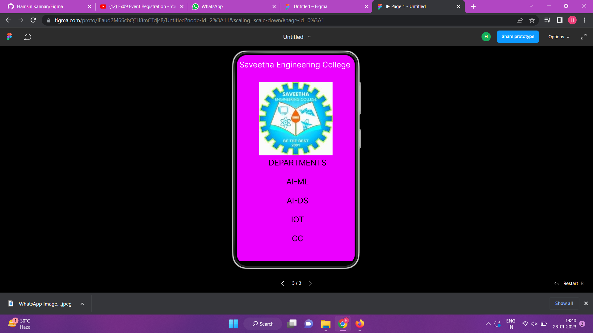

# Event Registration Web Application

## AIM:
To design, develop and deploy a web application for event registration.

## DESIGN STEPS:

### Step 1:
Create a new frame.

### Step 2:
Select any one preset size of your choice.

### Step 3:
Select the shapes you need.

### Step 4:
Import images as needed.

### Step 5:
Create pages based on your need and link them.

### Step 6:

Validate the HTML and CSS code.

### Step 6:

Publish the website in the given URL.

## DESIGN TOOL:
Figma

## code:
```
/* Home Page */
box-sizing: border-box;
position: relative;
width: 360px;
height: 640px;
background: #FF0E0E;
border: 1px solid #000000;
box-shadow: 0px 4px 4px rgba(0, 0, 0, 0.25);


/* Login Page */
position: relative;
width: 380px;
height: 637px;
background: #EBFF00;

/* logo */
position: absolute;
width: 225px;
height: 224px;
left: 67px;
top: 83px;
background: url(WhatsApp Image 2023-01-29 at 1.56.jpg);


/* Saveetha Engineering College */
position: absolute;
width: 354px;
height: 68px;
left: 0px;
top: 15px;
font-family: 'Inter';
font-style: normal;
font-weight: 400;
font-size: 24px;
line-height: 29px;
text-align: center;
color: #FFFFFF;


/* DEPARTMENTS AI-ML AI-DS IOT CC */
position: absolute;
width: 214px;
height: 248px;
left: 78px;
top: 315px;
font-family: 'Inter';
font-style: normal;
font-weight: 400;
font-size: 24px;
line-height: 29px;
text-align: center;
color: #000000;
```

## OUTPUT:




## RESULT:
The program to design, develop and deploy a web application for event registration is completed successfully.